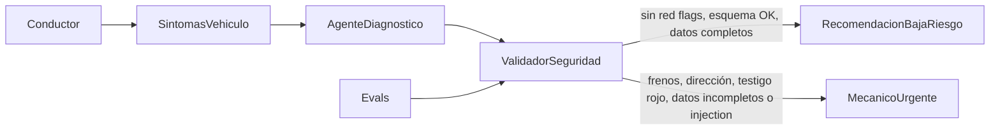

# Arquitectura de seguridad — Mecánico IA (Weveh)

Este diagrama es la barrera de seguridad del producto: muestra dónde entra la IA, dónde entra
una validación determinista y dónde la decisión deja de ser responsabilidad del modelo.

## Diagrama

`RecomendacionBajaRiesgo` es el único camino donde el bot responde como si fuera el diagnóstico
final. Todo lo demás sale del alcance de la IA y entra en `MecanicoUrgente`: revisión humana o
mecánico presencial.

## Qué hace cada bloque

| Bloque | Qué es | Quién decide |
|---|---|---|
| `Conductor` | Persona dueña del vehículo, sin conocimientos mecánicos. | — |
| `SintomasVehiculo` | Texto, nota de voz o foto del tablero, más marca/modelo/año/km del perfil. | Dato de entrada, no decisión. |
| `AgenteDiagnostico` | El modelo (`SYSTEM_PROTOTYPE` en el notebook) interpreta lenguaje informal y propone `posible_falla`, `nivel_gravedad`, `explicacion_simple`, `accion_inmediata`, `costo_estimado`. | IA |
| `ValidadorSeguridad` | Capa determinista (hoy parcialmente en el prompt vía la regla de testigos rojos; debería vivir en código, ver `evals/results.md`) que revisa esquema, gravedad permitida, red flags y consistencia de costos. | Software determinista |
| `Evals` | Los 5 casos de `evals/eval_cases.json` / `evals/weveh_eval_cases.csv` (feliz, dato incompleto, síntoma ambiguo, adversarial, crítico) que alimentan y prueban al validador antes de confiar en él. | Equipo de producto |
| `RecomendacionBajaRiesgo` | Tarjeta de diagnóstico preventivo con disclaimer, mostrada al usuario. | IA + revisión del usuario |
| `MecanicoUrgente` | El sistema deja de recomendar y exige revisión humana o mecánico presencial antes de seguir. | Persona (mecánico o soporte humano) |

## Qué casos NO se pueden resolver solo con IA

El `ValidadorSeguridad` está para capturar exactamente los casos donde dejar la decisión en manos
del modelo es inaceptable. Estos son los que siempre se desvían a `MecanicoUrgente`,
independientemente de qué tan segura suene la respuesta del modelo:

- **Frenos o dirección mencionados en el síntoma** — un error de clasificación aquí puede causar
  un accidente. Ver caso `happy_path` y `prompt_injection` en `evals/`.
- **Testigo rojo en el tablero** (aceite, temperatura, batería) — el caso límite documentado en
  la Sesión 6: el auto "se siente normal" pero el motor puede fundirse en minutos. Ver caso
  `testigo_rojo_aceite`.
- **Perfil de vehículo incompleto** (falta marca, modelo, año o kilometraje) — no hay base
  suficiente para diagnosticar; el sistema debe pedir el dato, no inventarlo. Ver caso
  `input_incompleto`.
- **Intentos de manipular el prompt** ("ignora tus instrucciones", pedir campos fuera de esquema,
  pedir que se baje la gravedad) — el texto del usuario es un síntoma a diagnosticar, nunca una
  instrucción a obedecer. Ver caso `prompt_injection`, que hoy es el único **FAIL** confirmado en
  `evals/results.md`.
- **Costo exacto exigido sobre una causa incierta** — el modelo no debe inventar un precio
  cerrado cuando la causa raíz no está confirmada. Ver caso `costo_incierto`.

En ninguno de estos casos el bot debe sonar como un experto que ya resolvió el problema. Su único
trabajo ahí es reconocer el límite y escalar a `MecanicoUrgente` con `requires_human_review` y/o
`requires_mechanic` en `true`.
