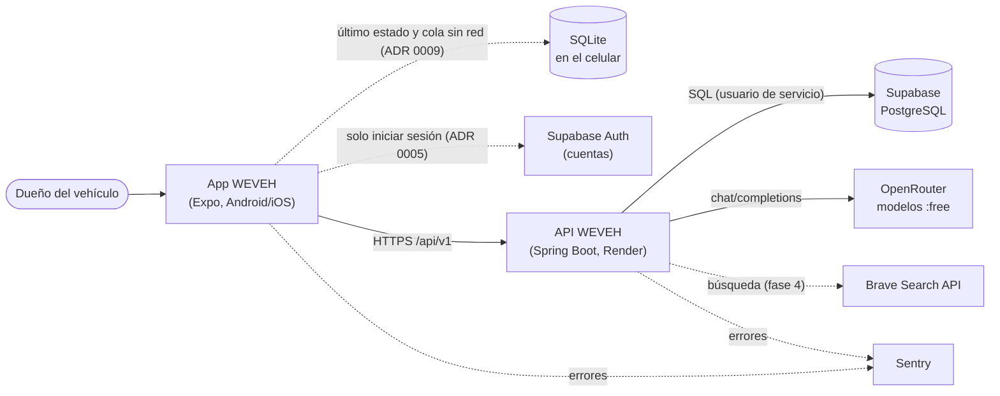
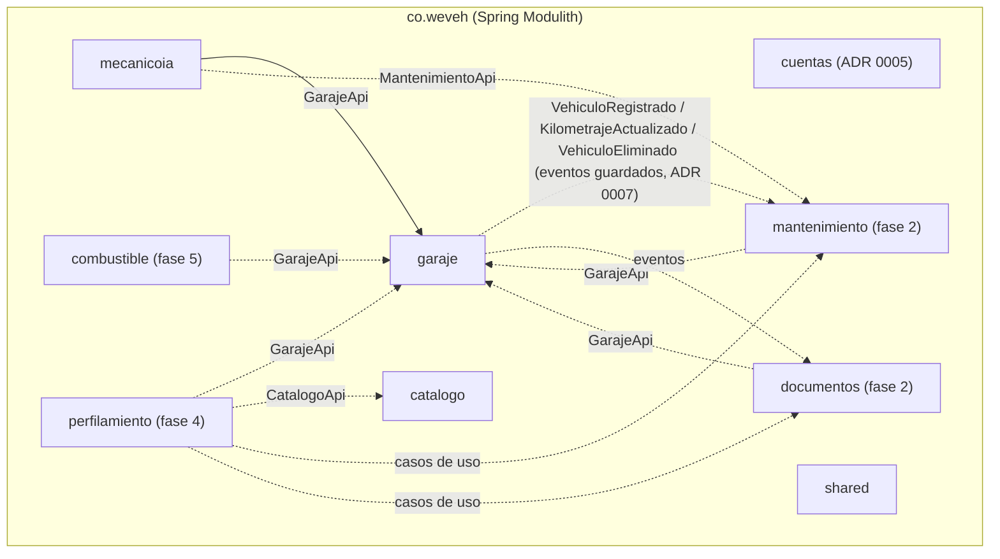
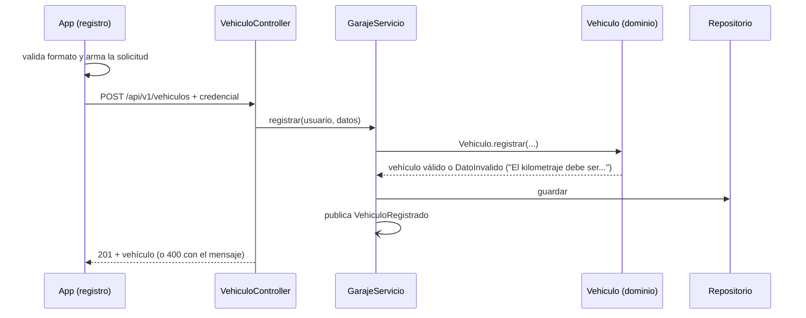
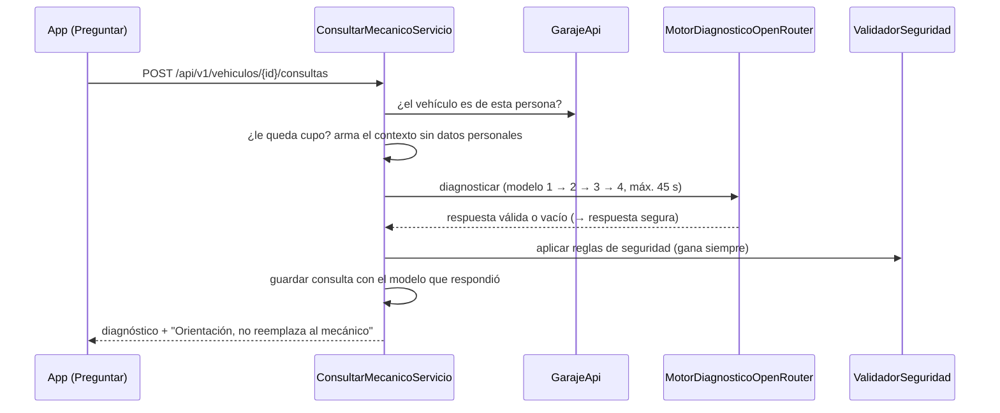

# Arquitectura de WEVEH (MVP)

Cómo está armado WEVEH y por qué. Las decisiones están en [`adr/`](adr/); el modelo de datos en [`datos.md`](datos.md); el contrato de la API en [`api.md`](api.md). Reglas para construir: skill `weveh-dev:arquitectura`.

**Convención de los diagramas:** línea continua = existe hoy; línea punteada y "(fase N)" = planeado. Revisado el 2026-10-10.

## Qué buscamos

WEVEH es un mecánico de confianza en el bolsillo que ya conoce tu carro: avisa antes de que algo se venza o se dañe, explica qué le pasa al vehículo sin jerga y reúne en un lugar su historia, sus papeles y su consumo. **La IA es la interfaz; el valor está en los datos del vehículo y en las reglas deterministas** (vencimientos, estado de piezas, seguridad), que decide el código y no el modelo. La arquitectura existe para proteger eso: reglas en un solo lugar, piezas reemplazables y fallas aisladas.

## 1. Contexto


```mermaid
flowchart LR
  U(["Dueño del vehículo"])
  APP["App WEVEH<br/>(Expo, Android/iOS)"]
  SQL[("SQLite<br/>en el celular")]
  AUTH["Supabase Auth<br/>(cuentas)"]
  API["API WEVEH<br/>(Spring Boot, Render)"]
  DB[("Supabase<br/>PostgreSQL")]
  IA["OpenRouter<br/>modelos :free"]
  WEB["Brave Search API"]
  SEN["Sentry"]
  U --> APP
  APP -. "último estado y cola sin red (ADR 0009)" .-> SQL
  APP -. "solo iniciar sesión (ADR 0005)" .-> AUTH
  APP -- "HTTPS /api/v1" --> API
  API -- "SQL (usuario de servicio)" --> DB
  API -- "chat/completions" --> IA
  API -. "búsqueda (fase 4)" .-> WEB
  API -. "errores" .-> SEN
  APP -. "errores" .-> SEN
```

| Pieza | Qué hace | Estado |
|---|---|---|
| App | Pantallas, formularios y validación de formato | ✅ |
| API | Reglas de negocio, seguridad, coordina la base y la IA | ✅ |
| Supabase PostgreSQL | Guarda los datos; nadie de afuera la lee (RLS sin políticas) | ✅ |
| OpenRouter | Modelos gratuitos para el Mecánico IA, con lista de respaldo | ✅ |
| Supabase Auth | Cuentas: correo, Google, enlace mágico | ⬜ ADR 0005 |
| SQLite | Último estado y cola de cambios sin red | ⬜ ADR 0009 |
| Brave Search API | Búsqueda del agente perfilador | 🔜 fase 4 |
| Sentry | Avisos de errores | ⬜ ADR 0010 |

**Reglas:**
- La app nunca lee ni escribe datos directo en Supabase; la única excepción es iniciar sesión con Supabase Auth.
- Las llaves (base de datos, OpenRouter, Brave) solo existen en el backend.
- Hoy la identidad es el header `X-Weveh-Dispositivo`; con ADR 0005 pasa a `Authorization: Bearer <token>` validado por el backend.
- Al modelo de IA solo llegan datos del vehículo y lo que la persona escribe: nunca nombre, correo, identificador, placa ni alias.

## 2. Módulos del backend


```mermaid
flowchart TB
  subgraph Backend["co.weveh (Spring Modulith)"]
    CTA["cuentas (ADR 0005)"]
    CAT["catalogo"]
    GAR["garaje"]
    MIA["mecanicoia"]
    MAN["mantenimiento (fase 2)"]
    DOC["documentos (fase 2)"]
    PER["perfilamiento (fase 4)"]
    COM["combustible (fase 5)"]
    SH["shared"]
  end
  MIA -- "GarajeApi" --> GAR
  MIA -. "MantenimientoApi" .-> MAN
  MAN -. "GarajeApi" .-> GAR
  DOC -. "GarajeApi" .-> GAR
  COM -. "GarajeApi" .-> GAR
  PER -. "GarajeApi" .-> GAR
  PER -. "CatalogoApi" .-> CAT
  PER -. "casos de uso" .-> MAN
  PER -. "casos de uso" .-> DOC
  GAR -. "VehiculoRegistrado / KilometrajeActualizado / VehiculoEliminado (eventos guardados, ADR 0007)" .-> MAN
  GAR -. "eventos" .-> DOC
```

Flechas continuas: llamadas a la fachada pública; punteadas: planeadas o eventos. Todos usan `shared` (errores Problem Details, `Kilometraje`, `TextoBusqueda`, reloj). Hoy `garaje` ya publica `VehiculoRegistrado` y `VehiculoEliminado`, pero nadie los escucha.

| Módulo | Responsabilidad | Fase | Estado |
|---|---|---|---|
| `shared` | Objetos de valor comunes, errores, reloj, configuración web | 0 | ✅ |
| `catalogo` | Marcas y líneas del Ministerio de Transporte por año fiscal; fichas técnicas | 1 | ✅ búsqueda · 🔜 fichas (fase 4), años fiscales (ADR 0014) |
| `garaje` | Vehículo: registrar, ver, editar, eliminar, kilometraje | 1 | ✅ · ⬜ kilometraje (fase 2) |
| `mecanicoia` | Mecánico IA conversacional, validador de seguridad, límites | 1 | ✅ una pregunta · ⬜ conversación y balde |
| `cuentas` | Perfil, consentimientos, eliminar la cuenta | 1 | ⬜ |
| `mantenimiento` | Plan por pieza, historial, fallas, salud | 2 | 🔜 |
| `documentos` | SOAT, RTM, seguro y avisos | 2 | 🔜 |
| `perfilamiento` | Agente investigador (Brave) y entrevistador | 4 | 🔜 |
| `combustible` | Tanqueadas y consumo | 5 | 🔜 |

**Si un módulo cae** (ADR 0003): si cae `garaje` no funcionan `mecanicoia`, `mantenimiento`, `documentos`, `combustible` ni `perfilamiento`; si cae `mecanicoia`, `combustible` o `perfilamiento`, el resto sigue. El interruptor por módulo y el cortacircuitos están en ADR 0010.

## 3. Forma de un módulo

```
co/weveh/<modulo>/
├── <Modulo>Api.java        # fachada pública: lo único que otros módulos usan
├── <Evento>.java           # eventos públicos del módulo
├── domain/                 # reglas: Java puro, records inmutables, objetos de valor
├── application/            # casos de uso + puertos/ (interfaces hacia afuera)
└── infrastructure/
    ├── web/                # controladores sin lógica y DTOs
    ├── persistencia/       # Spring Data JDBC: filas + repositorios + adaptador (ADR 0006)
    └── ia/                 # OpenRouter y buscador; con cortacircuitos y tiempos máximos (ADR 0010)
```

El dominio no conoce Spring, ni la base de datos, ni el proveedor de IA. Hoy los adaptadores de persistencia usan `JdbcClient`; pasan a Spring Data JDBC según ADR 0006.

## 4. App móvil

```
mobile/src/
├── app/                    # Expo Router, solo rutas: (onboarding)/ (tabs)/ preguntar
├── features/
│   ├── bienvenida/         # encendido, portada, a dónde ir al abrir
│   ├── catalogo/           # buscar marcas y líneas
│   ├── garaje/             # lista, registrar y eliminar (API)
│   ├── registro/           # formulario por pasos con la trama de W
│   ├── mecanico/           # Preguntar y diagnóstico
│   ├── inicio/             # "Esta semana"
│   ├── ajustes/            # Perfil y tema
│   └── cuentas/            # crear cuenta, iniciar sesión, política (ADR 0005, por construir)
└── shared/
    ├── design-system/      # tokens y componentes de los mockups
    ├── http/               # cliente: credencial y errores Problem Details
    ├── almacen/            # SecureStore en el celular, localStorage en web
    ├── navegacion/         # barra de pestañas y botón Preguntar
    ├── dispositivo/        # dispositivoId (se elimina con ADR 0005)
    └── db/                 # SQLite (por construir, ADR 0009)
```

Cada feature tiene `domain/` (funciones puras), `infrastructure/` (llamadas a la API), `application/` (hooks de TanStack Query) y `presentation/` (componentes). **Una feature solo usa el `index.ts` público de otra**, y `shared` no importa features (ESLint `boundaries`).

## 5. Dos flujos reales

### Registrar un vehículo


```mermaid
sequenceDiagram
  participant App as App (registro)
  participant API as VehiculoController
  participant S as GarajeServicio
  participant D as Vehiculo (dominio)
  participant R as Repositorio
  App->>App: valida formato y arma la solicitud
  App->>API: POST /api/v1/vehiculos + credencial
  API->>S: registrar(usuario, datos)
  S->>D: Vehiculo.registrar(...)
  D-->>S: vehículo válido o DatoInvalido ("El kilometraje debe ser...")
  S->>R: guardar
  S-)S: publica VehiculoRegistrado
  API-->>App: 201 + vehículo (o 400 con el mensaje)
```

### Preguntar al Mecánico IA


```mermaid
sequenceDiagram
  participant App as App (Preguntar)
  participant S as ConsultarMecanicoServicio
  participant G as GarajeApi
  participant M as MotorDiagnosticoOpenRouter
  participant V as ValidadorSeguridad
  App->>S: POST /api/v1/vehiculos/{id}/consultas
  S->>G: ¿el vehículo es de esta persona?
  S->>S: ¿le queda cupo? arma el contexto sin datos personales
  S->>M: diagnosticar (modelo 1 → 2 → 3 → 4, máx. 45 s)
  M-->>S: respuesta válida o vacío (→ respuesta segura)
  S->>V: aplicar reglas de seguridad (gana siempre)
  S->>S: guardar consulta con el modelo que respondió
  S-->>App: diagnóstico + "Orientación, no reemplaza al mecánico"
```

## 6. Datos

Detalle en [`datos.md`](datos.md). Resumen:
- **Supabase:** esquema `catalogo` (marcas y líneas, solo lectura) y `public` (datos de la persona). Migraciones solo con Flyway; RLS en todas las tablas; las tablas hijas se borran en cascada con el vehículo.
- **Celular:** SQLite con el último estado (ADR 0009); se borra al cerrar sesión.
