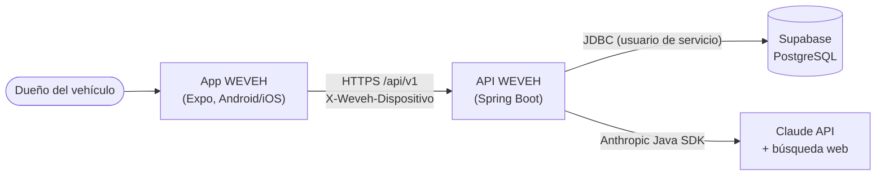
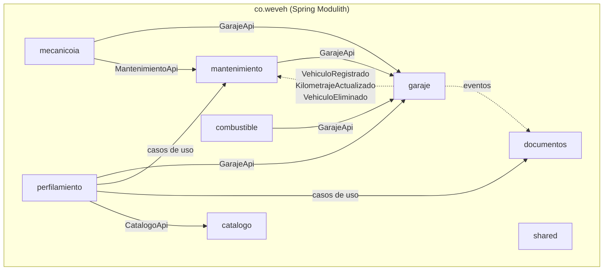
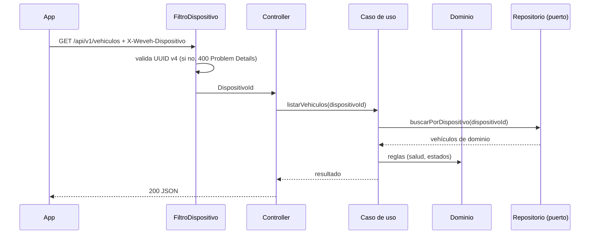

# Arquitectura de WEVEH (MVP)

Decisiones: [ADR 0001](adr/0001-stack.md), [ADR 0002](adr/0002-identidad-por-dispositivo.md), [ADR 0003](adr/0003-monolito-modular.md). Reglas detalladas: skill `weveh-dev:arquitectura`.

## Contexto


```mermaid
flowchart LR
  U(["Dueño del vehículo"])
  APP["App WEVEH<br/>(Expo, Android/iOS)"]
  API["API WEVEH<br/>(Spring Boot)"]
  DB[("Supabase<br/>PostgreSQL")]
  IA["Claude API<br/>+ búsqueda web"]
  U --> APP
  APP -- "HTTPS /api/v1<br/>X-Weveh-Dispositivo" --> API
  API -- "JDBC (usuario de servicio)" --> DB
  API -- "Anthropic Java SDK" --> IA
```

- La app nunca habla con Supabase ni con la API de Claude: todo pasa por la API.
- Al modelo de IA solo llega el contexto del vehículo, nunca placa ni `dispositivoId`.

## Módulos


```mermaid
flowchart TB
  subgraph Backend["co.weveh (Spring Modulith)"]
    CAT["catalogo"]
    GAR["garaje"]
    MAN["mantenimiento"]
    DOC["documentos"]
    COM["combustible"]
    PER["perfilamiento"]
    MIA["mecanicoia"]
    SH["shared"]
  end
  MAN -- "GarajeApi" --> GAR
  COM -- "GarajeApi" --> GAR
  MIA -- "GarajeApi" --> GAR
  MIA -- "MantenimientoApi" --> MAN
  PER -- "GarajeApi" --> GAR
  PER -- "casos de uso" --> MAN
  PER -- "casos de uso" --> DOC
  PER -- "CatalogoApi" --> CAT
  GAR -. "VehiculoRegistrado<br/>KilometrajeActualizado<br/>VehiculoEliminado" .-> MAN
  GAR -. "eventos" .-> DOC
```

Todos los módulos usan `shared` (`DispositivoId`, `Kilometraje`, Problem Details). Las flechas continuas son llamadas a la fachada pública; las punteadas, eventos.

| Módulo | Responsabilidad | Fase |
|---|---|---|
| `shared` | Value objects comunes, filtro de dispositivo, manejo de errores | 0 |
| `catalogo` | Marcas y líneas del Ministerio de Transporte; fichas técnicas investigadas | 1 |
| `garaje` | Vehículo, registro, kilometraje | 0 / 1 |
| `mantenimiento` | Plan por pieza, historial, fallas, salud | 2 |
| `documentos` | SOAT, RTM, seguro todo riesgo | 2 |
| `mecanicoia` | Diagnóstico por texto y `ValidadorSeguridadDiagnostico` | 3 |
| `perfilamiento` | Agente investigador y entrevistador | 4 |
| `combustible` | Tanqueadas y consumo | 5 |

## Forma de un módulo

```
co/weveh/<modulo>/
├── <Modulo>Api.java        # fachada pública
├── domain/                 # Java puro: reglas, entidades, value objects
├── application/            # casos de uso + puertos/
└── infrastructure/
    ├── web/                # controladores y DTOs
    ├── persistencia/       # JPA y adaptadores
    └── ia/                 # SDK de Anthropic (solo mecanicoia y perfilamiento)
```

## App móvil

```
mobile/
├── app/                    # Expo Router: (onboarding)/ y (tabs)/
└── src/
    ├── features/<feature>/{presentation,application,domain,infrastructure}
    └── shared/{design-system,http,db,dispositivo,errores}
```

Lectura offline desde SQLite con TanStack Query refrescando en segundo plano; escrituras sin red en una cola con `Idempotency-Key`.

## Flujo de una petición


```mermaid
sequenceDiagram
  participant App
  participant F as FiltroDispositivo
  participant C as Controller
  participant S as Caso de uso
  participant D as Dominio
  participant R as Repositorio (puerto)
  App->>F: GET /api/v1/vehiculos + X-Weveh-Dispositivo
  F->>F: valida UUID v4 (si no, 400 Problem Details)
  F->>C: DispositivoId
  C->>S: listarVehiculos(dispositivoId)
  S->>R: buscarPorDispositivo(dispositivoId)
  R-->>S: vehículos de dominio
  S->>D: reglas (salud, estados)
  S-->>C: resultado
  C-->>App: 200 JSON
```

## Datos

- Esquema `catalogo`: marcas y líneas (solo lectura para la app).
- Esquema `public`: vehículo, kilometraje, plan, servicios, fallas, documentos, tanqueadas, fichas técnicas, sesiones de perfilamiento y consultas al mecánico. Modelo completo en `plugins/weveh-dev/skills/dominio-vehiculo/references/modelo-dominio.md`.
- Migraciones solo con Flyway. RLS activado en todas las tablas sin políticas públicas. Las tablas hijas borran en cascada al eliminar el vehículo.
