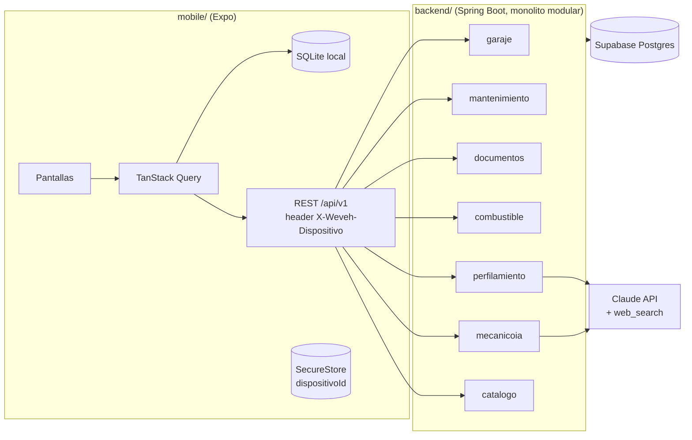

# Arquitectura de WEVEH (MVP)

## Vista general



## Módulos del backend

| Módulo | Responsabilidad | Publica eventos |
|---|---|---|
| `catalogo` | Marcas y líneas de Colombia de las tablas del Ministerio de Transporte (solo lectura); fichas técnicas investigadas | — |
| `garaje` | Vehículo: CRUD, kilometraje, datos de catálogo | `VehiculoRegistrado`, `KilometrajeActualizado`, `VehiculoEliminado` |
| `mantenimiento` | Plan por pieza, historial de servicios, fallas, salud | `PiezaPorVencer` |
| `documentos` | SOAT, RTM, seguro todo riesgo y su vencimiento | `DocumentoPorVencer` |
| `combustible` | Tanqueadas y consumo km/gal | `ConsumoAnomalo` |
| `perfilamiento` | Agente que investiga el modelo y entrevista al usuario | `PerfilCompletado` |
| `mecanicoia` | Diagnóstico por texto + `ValidadorSeguridadDiagnostico` | — |
| `shared` | Value objects comunes (`Kilometraje`, `DispositivoId`), errores, Problem Details | — |

Dependencias permitidas: todos pueden usar `shared`; `mantenimiento`, `perfilamiento` y `mecanicoia` leen el vehículo vía la API pública de `garaje` (`GarajeApi`), nunca vía su repositorio. `perfilamiento` escribe en `mantenimiento` y `documentos` solo a través de sus casos de uso.

## Forma de cada módulo

```
co/weveh/<modulo>/
├── <Modulo>Api.java            # fachada pública (lo único que otros módulos usan)
├── domain/                     # entidades, value objects, reglas. Java puro: sin Spring, sin JPA
├── application/
│   ├── <CasoDeUso>.java        # interfaz (puerto de entrada)
│   ├── <CasoDeUso>Servicio.java
│   └── puertos/                # interfaces de salida: repositorios, MotorDiagnostico, InvestigadorFichaTecnica...
└── infrastructure/
    ├── web/                    # @RestController + DTOs (records) + mapeadores
    ├── persistencia/           # entidades JPA + adaptadores de repositorio
    └── ia/                     # adaptadores del SDK de Anthropic (único lugar donde aparece)
```

Reglas:
- Controlador: valida formato, llama un caso de uso, mapea respuesta. Nada más.
- La regla de negocio vive en `domain` (por ejemplo `Vehiculo.actualizarKilometraje`), no en servicios ni controladores.
- Entidad JPA ≠ entidad de dominio. Mapea en el adaptador.
- Cada caso de uso recibe `DispositivoId` y filtra por él. Un recurso de otro dispositivo responde **404**, no 403.
- Migraciones de esquema solo con Flyway en `backend/src/main/resources/db/migration` (`V<n>__descripcion.sql`). Nunca cambios manuales en Supabase.
- Spring Modulith viene desde la fase 0 (versión gestionada por el BOM que trae start.spring.io). La prueba `ModularidadTest` con `ApplicationModules.of(WevehApplication.class).verify()` es obligatoria y corre en CI.
- Los eventos entre módulos (`VehiculoRegistrado`, `KilometrajeActualizado`...) se publican con `ApplicationEventPublisher` y se escuchan con `@ApplicationModuleListener`.

## App móvil

```
mobile/
├── app/                        # Expo Router: solo rutas
│   ├── _layout.tsx
│   ├── (onboarding)/           # encendido, portada, registro de vehículo, completar perfil
│   └── (tabs)/                 # inicio, garaje, preguntar, combustible
└── src/
    ├── features/<feature>/{presentation,application,domain,infrastructure}
    └── shared/{design-system,http,db,dispositivo,errores}
```

- `presentation`: componentes puros (props → UI). `application`: hooks con TanStack Query. `domain`: funciones puras. `infrastructure`: cliente HTTP, SQLite, mapeadores DTO→dominio.
- Una feature no importa archivos internos de otra; comparte por `src/shared` o por el `index.ts` público de la feature.
- Lectura offline: la UI lee de SQLite y TanStack Query refresca en segundo plano. Las escrituras sin red van a una cola con `Idempotency-Key`.
- Diseño: tokens de marca de los mockups (teal `#3CCFB6` sobre fondo oscuro, punto ámbar), modo claro/oscuro, textos sin jerga.

## Identidad sin login

1. Primer arranque: `crypto.randomUUID()` → SecureStore (`weveh.dispositivoId`).
2. Interceptor HTTP agrega `X-Weveh-Dispositivo`.
3. Backend: un filtro valida que sea UUID v4 y lo deja en un `DispositivoId` por request; sin header ⇒ 400.
4. Limitaciones que deben quedar escritas en la UI de ajustes: si desinstalas la app pierdes el acceso a tus datos. Cuando llegue el login, se vincula el `dispositivoId` a la cuenta.

## Supabase

- Un proyecto con dos esquemas: `catalogo` (tablas del Ministerio de Transporte) y `public` (datos de la app).
- El backend se conecta por JDBC con un usuario de servicio (variables `WEVEH_DB_URL`, `WEVEH_DB_USUARIO`, `WEVEH_DB_CLAVE`).
- RLS activado en todas las tablas sin políticas para `anon`/`authenticated`.

## Antes de terminar un cambio de arquitectura

- ¿Alguna clase de `domain` importa Spring, JPA o el SDK de IA? Debe ser no.
- ¿Algún módulo importa `infrastructure` o `domain` de otro? Debe ser no.
- ¿La decisión merece un ADR en `docs/adr/NNNN-titulo.md` (contexto, decisión, alternativas, consecuencias)? Si cambia el stack, sí.
