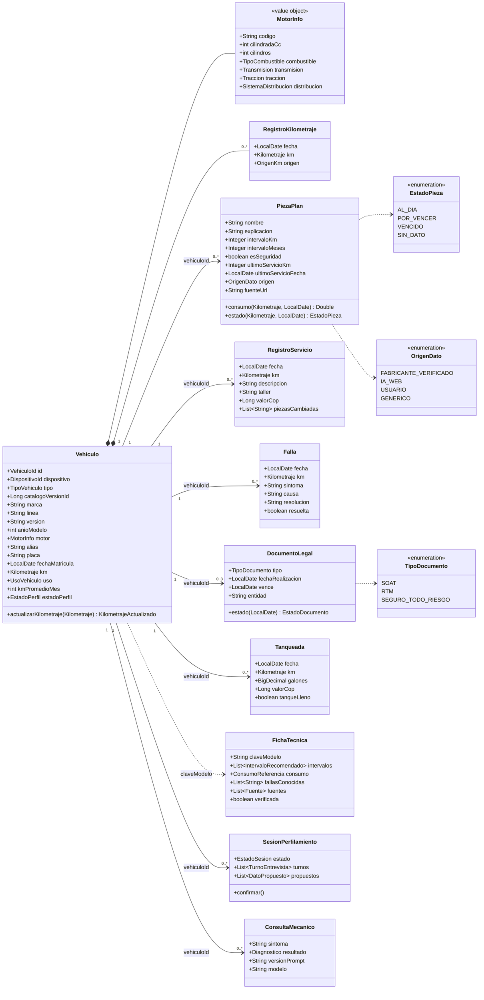
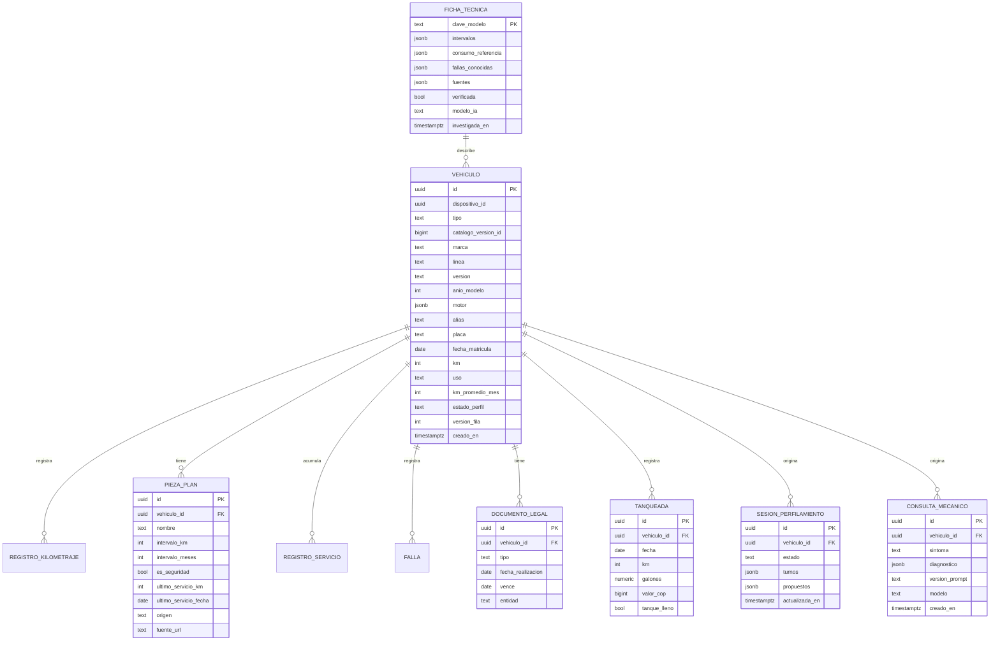

# Modelo de dominio del MVP

Versión revisada tras la decisión de quitar el login y enriquecer el perfil del vehículo. Los módulos se relacionan por id (`vehiculoId`), no por referencia de objeto; el diagrama los junta para leerlo completo.

## Diagrama de clases

`claveModelo` = `marca|linea|anioModelo|codigoMotor` normalizado (minúsculas, sin tildes). Varias personas con el mismo modelo comparten la ficha investigada, lo que abarata la IA y es la base de los datos agregados.

## Tablas (PostgreSQL)

Índices mínimos: `vehiculo(dispositivo_id)`, `pieza_plan(vehiculo_id)`, `documento_legal(vence)`, `tanqueada(vehiculo_id, km)`. Todas las tablas hijas con `ON DELETE CASCADE` para que eliminar un vehículo borre todo lo suyo.
