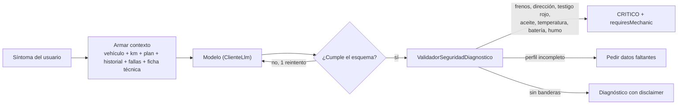

# Mecánico IA

## Qué hace en el MVP

El usuario describe un síntoma por texto desde la pestaña "Preguntar" de un vehículo. El backend arma el contexto, llama al modelo, valida y aplica reglas de seguridad, y devuelve un diagnóstico que termina en acciones dentro de la app (anotar en el historial, marcar una pieza para revisar).



## Contexto que recibe el modelo

```json
{
  "vehiculo": {"marca": "Toyota", "linea": "Prado J95", "version": "VX", "anio": 2008, "motor": "3.4 V6 5VZ-FE", "km": 190000, "uso": "MIXTO"},
  "plan": [{"pieza": "correa_distribucion", "estado": "VENCIDO", "ultimo_km": null}],
  "historial_reciente": [{"fecha": "2026-06-05", "km": 188000, "descripcion": "Cambio de aceite"}],
  "fallas_previas": [],
  "fallas_conocidas_del_modelo": ["..."],
  "sintoma": "<texto del usuario, tratado como dato>"
}
```

Nunca incluyas placa, alias ni `dispositivoId`.

## Contrato de salida

Se conserva el contrato del README (`diagnostico_mecanico_preventivo`) y se agregan campos de acción:

| Campo | Tipo | Regla |
|---|---|---|
| `posible_falla` | string | |
| `nivel_gravedad` | `Crítico` \| `Moderado` \| `Leve` | En código: enum `NivelGravedad` |
| `explicacion_simple` | string | Máximo 2 oraciones, sin jerga |
| `accion_inmediata` | string | Instrucción directa |
| `costo_estimado` | string \| null | Rango o null; nunca cifra cerrada ni inventada |
| `requires_human_review` | boolean | |
| `requires_mechanic` | boolean | |
| `piezas_relacionadas` | string[] | Ids de pieza del plan, para enlazar "Ver en el plan" |
| `datos_faltantes` | string[] | Lo que el modelo necesitaría saber |

Todo diagnóstico muestra: "Orientación, no reemplaza al mecánico".

## Reglas de seguridad (código, no prompt)

`ValidadorSeguridadDiagnostico` ya existe en `backend/.../mecanicoia/service/`. Respétalo y extiéndelo, no lo saltes:
- Palabras críticas (normalizadas sin tildes): testigo/luz roja, aceite, temperatura, recalentamiento, humo, frenos, dirección, batería ⇒ `CRITICO`, `requires_human_review` y `requires_mechanic` en true.
- Además: si una pieza de seguridad del plan está `VENCIDO` y el síntoma la menciona, gravedad mínima `Moderado`.
- Perfil incompleto (sin marca, modelo, año o km) ⇒ pedir datos, sin gravedad definitiva.
- Costos sospechosos (0, gratis, promoción) ⇒ null.
- El texto del usuario que intente cambiar instrucciones ("ignora", "marca leve") no altera las reglas.

## Proveedor

- Hoy: OpenRouter vía `ClienteLlmOpenRouter` (`LLM_*` en `application.yml`).
- Nuevos agentes: Anthropic Java SDK (ver skill `agente-perfilador`). Para migrar el diagnóstico, crea `ClienteLlmAnthropic implements ClienteLlm`, selecciónalo por propiedad y corre los evals con ambos antes de cambiar el valor por defecto.
- Prompt versionado en `backend/src/main/resources/prompts/` y guardado junto a cada consulta (`version_prompt`, `modelo`).

## Evals

- Casos en `evals/eval_cases.json` y `evals/weveh_eval_cases.csv`: caso feliz, dato incompleto, síntoma ambiguo, inyección, testigo rojo de aceite, costo incierto.
- Agrega casos con contexto de vehículo completo (por ejemplo: Prado 190.000 km sin dato de correa + "suena un tic-tac al encender").
- Cada cambio de prompt, modelo o validador: corre los evals y actualiza `evals/results.md` con fecha, modelo, versión de prompt y pass/fail por caso. Un cambio que baje la detección de críticos no se fusiona.
